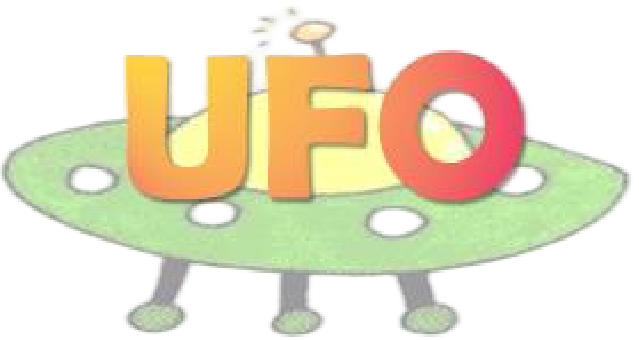

<h1 align="center">
  UFO: A General <b>U</b>nsupervised Reinforcement Learning <b>F</b>ramework for Humanoid C<b>O</b>ntrol
</h1>

<p align="center">
  <a href="https://roboparty.github.io/UFO/"></a>
  <a href="https://youtu.be/uJPcLdn9sNA"></a>
  <a href="https://roboparty.github.io/UFO/assets/UFO.pdf"></a>
</p>

<p align="center">
  <a href="README.md">English</a> | <a href="README_zh-CN.md">中文</a>
</p>

<p align="center">
  
  &nbsp;&nbsp;&nbsp;&nbsp;&nbsp;&nbsp;
  
</p>

<!-- <p align="center">
  
</p> -->

## Overview

UFO is an open-source unsupervised reinforcement learning framework for humanoid control. The `main` branch focuses on MJLab training, robot-aware motion-data import, tracking/goal/reward inference, and ONNX export. The most complete and best-tested path is currently Unitree G1.

UFO is designed to separate the learning pipeline from robot-specific configuration where practical, but new robot bring-up is still experimental. A new robot requires a MuJoCo XML, optionally a matching URDF, and motion data that has already been adapted or retargeted to that robot in RobotState format. UFO does not automatically retarget human motion or another robot's motion to a new robot, and one checkpoint cannot be directly reused across robots with different bodies, actions, or observation dimensions.

## What is supported?

| Capability | Status |
| --- | --- |
| Unitree G1 training | Supported and best tested |
| Motion data: RobotState CSV / NPZ / `ufo_pkl` | Supported |
| Multi-source data manifest | Supported |
| Tracking inference | Robot-config aware |
| Goal inference | Robot-config aware; non-G1 requires robot-specific goal JSON |
| Reward inference | G1 full default tasks; non-G1 currently limited to root/locomotion tasks |
| Deployment and teleoperation | Use the [`deploy` branch](https://github.com/Roboparty/UFO/tree/deploy) / UFO-Deploy runtime |
| Automatic motion retargeting | Not supported |
| Cross-robot shared-policy training | Not supported |

> [!NOTE]
> `main` branch = training / data import / inference / ONNX export.
> `deploy` branch = G1 real-robot deployment / teleoperation runtime.

## Installation

Clone UFO first:

```bash
git clone https://github.com/Roboparty/UFO.git
cd UFO
```

Install [`uv`](https://docs.astral.sh/uv/):

```bash
curl -LsSf https://astral.sh/uv/install.sh | sh
source ~/.local/bin/env
```

Alternatively:

```bash
python -m pip install --user uv
export PATH="$HOME/.local/bin:$PATH"
```

Install the environment:

```bash
uv sync
```

For W&B logging, authenticate before starting a multi-process run:

```bash
uv run wandb login
# Or: export WANDB_API_KEY=your_wandb_api_key
```

## Path A: Unitree G1 Quick Start

The G1 path is the recommended route for first-time users because it is the most complete and best tested.

### 1. Download G1 motion data

Large motion datasets are hosted separately so that the Git repository only contains code and lightweight metadata. Download the processed G1 LaFAN data with:

```bash
bash scripts/download_data.sh g1_lafan
ls -lh humanoidverse/data/lafan_29dof_10s-clipped.pkl
```

The download script verifies the SHA256 checksum and places the default processed training file under `humanoidverse/data/`.

### 2. Run a G1 smoke test

Run this first to verify the environment, motion data, and short training loop:

```bash
./run_train.sh \
  --agent fb \
  --data-manifest configs/data/example_mix.yaml \
  --gpu-ids single \
  --smoke \
  --work-dir /tmp/ufo_smoke_g1
```

### 3. Full FB training on G1

```bash
CUDA_VISIBLE_DEVICES=0,1,2,3,4,5,6,7 \
./run_train.sh \
  --agent fb \
  --gpu-ids all \
  --num-envs 1024 \
  --num-env-steps 192000000 \
  --work-dir runs/ufo_fb_g1 \
  --data-path humanoidverse/data/lafan_29dof_10s-clipped.pkl \
  --update-z-every-step 100 \
  --buffer-size 5120000 \
  --use-wandb \
  --wandb-run-name ufo_fb_g1
```

### 4. TeCH training on G1

```bash
CUDA_VISIBLE_DEVICES=0,1,2,3,4,5,6,7 \
./run_train.sh \
  --agent tech \
  --gpu-ids all \
  --num-envs 1024 \
  --num-env-steps 192000000 \
  --work-dir runs/ufo_tech_g1 \
  --data-path humanoidverse/data/lafan_29dof_10s-clipped.pkl \
  --update-z-every-step 10 \
  --buffer-size 5120000 \
  --use-wandb \
  --wandb-run-name ufo_tech_g1
```

TeCH was previously exposed as TLDR in early UFO versions. `--agent tldr` is kept as a deprecated compatibility alias for `--agent tech`.

Core defaults live in `humanoidverse/train.py`. In particular, `--num-envs` and `--buffer-size` are per GPU, while `--num-env-steps` is the global sample budget.

### 5. Tracking inference and ONNX export

Use full motion sequences for inference, not clipped training data:

```bash
CUDA_VISIBLE_DEVICES=0 \
uv run python -m humanoidverse.tracking_inference \
  --model-folder runs/ufo_fb_g1 \
  --data-path /path/to/full_motions.pkl \
  --device cuda:0 \
  --headless \
  --save-mp4 \
  --motion-list 0 \
  --export-onnx true

CUDA_VISIBLE_DEVICES=0 \
uv run python -m humanoidverse.tracking_inference \
  --model-folder runs/ufo_fb_lafan1_mini3_7gpu_ReviseFeetRoll_AddJointParams_LieDown_Delay \
  --data-path humanoidverse/data/lafan1_mini3_ufo/fallAndGetUp1_subject1__clip004.pkl \
  --robot-config configs/robots/mini3.yaml \
  --device cuda:0 \
  --headless \
  --save-mp4 \
  --motion-list 0 \
  --export-onnx true
```
```

Outputs are written to `<model-folder>/tracking_inference/`. With `--export-onnx`, tracking inference exports a robot-config-aware ONNX policy and a companion metadata JSON. The metadata records the robot config, XML path, controlled joints, actor input dimensions, z dimension, actor observation dimension, and output action dimension.

The exported ONNX is tied to the checkpoint's robot, action, and observation dimensions. It should not be reused for another robot without training/exporting a checkpoint for that robot.

## Path B: Bring Up a New Robot

This path is experimental. It assumes you already have:

- a MuJoCo XML for the target robot;
- optionally a matching URDF;
- RobotState motion data already adapted or retargeted to the same robot.

UFO does not automatically retarget human motion or another robot's motion into a new robot. External retargeting tools such as `hhtools`, GMR, or custom pipelines can be used before importing data into UFO.

### 1. Generate robot config drafts

```bash
uv run python -m humanoidverse.tools.robot_inspect \
  --xml /path/to/robot.xml \
  --urdf /path/to/robot.urdf \
  --name my_robot \
  --out configs/robots/my_robot.yaml \
  --hydra-out humanoidverse/config/robot/my_robot/my_robot_auto.yaml
```

Omit `--urdf` if you only have MJCF. URDF is auxiliary. The MuJoCo XML remains the source of truth for qpos/qvel layout, action layout, and actuator order.

### 2. Manually review robot semantics

The generated files are drafts. Before large-scale training, manually review the base body, control-joint order, feet, hands, key bodies, initial state, PD gains, actuator limits, contact bodies, and termination/reward-related semantics.

### 3. Build RobotState data manifest

```bash
uv run python -m humanoidverse.tools.data_build \
  --robot configs/robots/my_robot.yaml \
  --source "/path/to/motions/*.csv" \
  --format robot_state_csv \
  --name my_motion \
  --fps 50 \
  --clip-seconds 10 \
  --out configs/data/my_motion_auto_build.yaml \
  --rebuild-cache
```

Headerless RobotState CSV files are accepted. Without a header, columns are interpreted as `root_pos` xyz, `root_quat` xyzw, then DOF positions in the robot XML/control-joint order; an optional leading `time` column is also accepted.

Optional: run `humanoidverse.tools.data_inspect` first if you want to validate the CSV schema without building cache files.

### 4. Run smoke training

```bash
./run_train.sh \
  --agent fb \
  --robot-config configs/robots/my_robot.yaml \
  --data-manifest configs/data/my_motion_auto_build.yaml \
  --gpu-ids single \
  --smoke \
  --work-dir /tmp/ufo_smoke_my_robot
```

### 5. Known constraints for new robots

- The robot-config path is experimental.
- New robots may require environment, controller, reward, contact, or termination tuning.
- Non-G1 goal inference needs robot-specific goal JSON.
- Non-G1 reward inference currently focuses on root/locomotion tasks unless robot-specific semantics are added.
- The `deploy` branch remains G1-oriented unless a robot-specific deploy runtime is created.
- One checkpoint cannot be reused across robots with different morphology, action dimensions, or observation dimensions.

See [Import Wizard](docs/import_wizard.md) for data schemas and import commands, and [Robot-Config Training](docs/robot_config_training.md) for required training fields, current constraints, and bring-up guidance.

## Multi-source skill injection

UFO supports manifest-based, source-weighted multi-source data mixing. This is useful for injecting rare agile skills, such as cartwheel motions, while preserving the base motion distribution. The dataset identity is sampled from a fixed source ratio, and prioritized sampling is applied within each source. See `configs/data/example_mix.yaml` for a compact manifest example.

## Documentation

- [Import Wizard](docs/import_wizard.md): RobotState schemas, inspection, and data building.
- [Robot-Config Training](docs/robot_config_training.md): experimental robot-aware training initialization.
- [Training and Inference](docs/TRAIN_INFERENCE.md): additional commands and runtime notes.
- [Deploy branch](https://github.com/Roboparty/UFO/tree/deploy): G1 real-robot deployment and teleoperation runtime.

## Citation / License

If you find UFO useful in your research, please cite:

```bibtex
@misc{ufo2026,
  author       = {{RoboParty Lab Team}},
  title        = {UFO: An Unsupervised Reinforcement Learning Framework for Humanoid Control},
  year         = {2026},
  howpublished = {\url{https://github.com/Roboparty/UFO}},
  note         = {Project page: \url{https://roboparty.github.io/UFO/}}
}
```

License: see [LICENSE](LICENSE).
